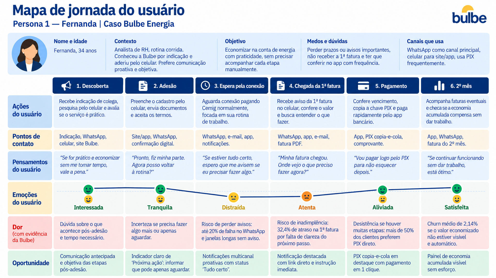

# Persona 1 — Fernanda

Nome e idade: Fernanda, 34 anos

Contexto: Trabalha como analista de Recursos Humanos e tem uma rotina profissional corrida. Conheceu a Bulbe por indicação de uma colega de trabalho e decidiu aderir pelo celular após entender que poderia economizar na conta de energia. Tem facilidade com tecnologia, mas não gosta de precisar acompanhar constantemente aplicativos ou processos.

Objetivo: Economizar na conta de energia de forma prática, sem precisar acompanhar manualmente todas as etapas do serviço.

Medos e dúvidas: Tem receio de perder alguma informação importante, não perceber quando precisa realizar uma ação, não receber a primeira fatura ou deixar passar o vencimento. Também quer ter certeza de que está tudo funcionando sem precisar ficar entrando no aplicativo para conferir.

Canais que usa: WhatsApp como principal canal, celular para acessar o site ou aplicativo, PIX para pagamentos e e-mail ocasionalmente.

## Mapa de jornada

[Mapa de jornada em PNG](../wireframes/jornada-1.png)

| Fase | Ações | Pontos de contato | Pensamentos | Emoção | Dor (com evidência da Bulbe) | Oportunidade |
| --- | --- | --- | --- | --- | --- | --- |
| Descoberta | Recebe uma indicação de uma colega, acessa o site pelo celular e pesquisa como funciona a economia na conta de energia | Indicação, WhatsApp, celular, site, landing page | “Se eu conseguir economizar sem precisar ficar acompanhando tudo, vale a pena.” | Interessada | Precisa entender rapidamente como o serviço funciona e o que acontecerá depois da adesão para se sentir segura; falta de entendimento do produto representa 27,7% dos motivos de churn | Explicar de forma simples como a Bulbe funciona, qual é o benefício e quais serão as próximas etapas após a adesão |
| Adesão | Faz o cadastro pelo celular, envia os dados necessários e aceita os termos para concluir a contratação | Site, celular, WhatsApp, confirmação da contratação | “Pronto, fiz minha parte. Agora posso voltar para minha rotina?” | Tranquila | Depois da contratação, pode não saber se precisa realizar alguma ação ou se deve apenas aguardar; o onboarding possui diversas comunicações distribuídas ao longo dos dias | Criar uma indicação clara de “Próxima ação”, informando se a cliente precisa fazer algo ou se pode simplesmente aguardar |
| Espera pela conexão | Aguarda a qualificação e a conexão, continua pagando a Cemig e volta à sua rotina sem acompanhar constantemente o processo | WhatsApp, e-mail, aplicativo, celular | “Se estiver tudo certo, espero que me avisem quando eu precisar fazer alguma coisa.” | Distraída | Aproximadamente 20% das mensagens via WhatsApp apresentam falha de entrega e houve períodos de até 20 dias sem comunicação durante o onboarding, aumentando o risco de Fernanda não perceber uma informação importante | Criar comunicação proativa e multicanal, informando claramente quando está tudo certo e quando existe alguma ação pendente |
| Chegada da 1ª fatura | Recebe a comunicação, acessa a primeira fatura pelo celular, verifica o valor e procura identificar o que precisa fazer | WhatsApp, aplicativo, celular, e-mail, fatura | “Minha primeira fatura chegou. Preciso pagar agora? Onde eu vejo o que tenho que fazer?” | Atenta | Se a comunicação não for percebida ou não deixar clara a próxima ação, pode haver atraso no pagamento; a inadimplência acumulada da 1ª fatura foi de 32,4% entre setembro/2025 e julho/2026 | Destacar claramente a primeira fatura, o valor, o vencimento e a ação necessária, com acesso direto ao pagamento |
| Pagamento | Confere o valor e o vencimento, escolhe o PIX e realiza o pagamento pelo celular | Fatura, aplicativo, celular, PIX | “Vou resolver isso agora pelo PIX para não precisar lembrar depois.” | Aliviada | Se o pagamento exigir muitas etapas, pode deixar para depois por causa da rotina corrida; mais de 50% da base já utiliza PIX para pagamento das faturas | Tornar o PIX uma opção rápida e visível, reduzindo as etapas entre a abertura da fatura e a confirmação do pagamento |
| 2º mês | Continua utilizando o serviço, recebe as comunicações e verifica eventualmente se a economia obtida compensa a permanência na Bulbe | Aplicativo, WhatsApp, fatura, celular | “Se continuar funcionando sem me dar trabalho, está ótimo.” | Satisfeita | Se a economia não estiver evidente, pode não perceber o benefício do serviço e questionar se vale a pena continuar; o churn após a primeira fatura teve média de aproximadamente 2,14% ao mês em 2026 | Apresentar automaticamente a economia acumulada, mostrando de forma simples o benefício obtido sem exigir que a cliente procure essa informação |