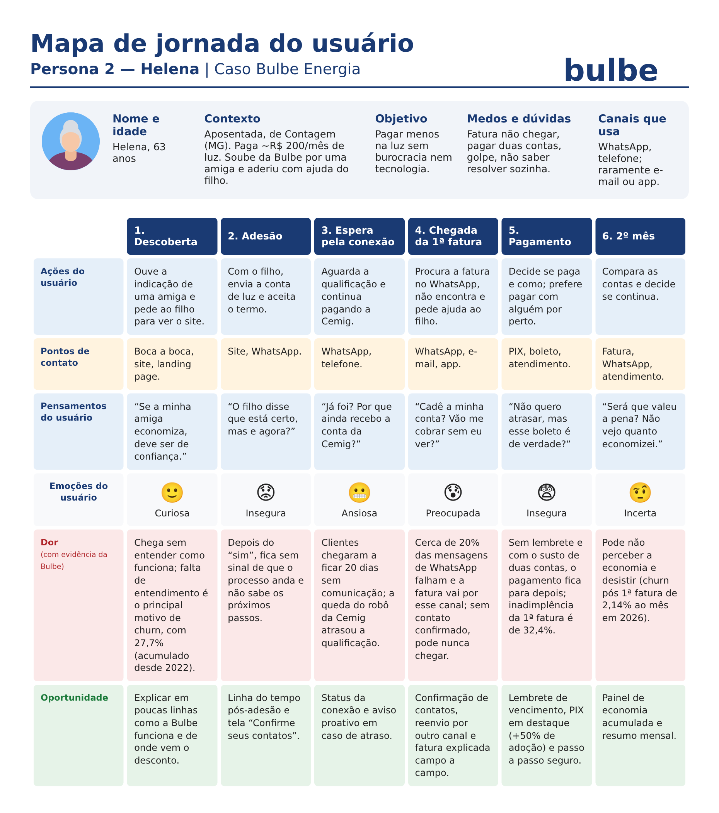

# Persona 2 — Helena

Nome e idade: Helena, 63 anos

Contexto: Aposentada, mora em Contagem (MG) e paga cerca de R$ 200 por mês de luz. Ficou sabendo da Bulbe por uma amiga da igreja e aderiu pelo celular com a ajuda do filho. Usa pouco o e-mail e não costuma instalar aplicativos.

Objetivo: Pagar menos na conta de luz sem ter que lidar com burocracia ou tecnologia.

Medos e dúvidas: Tem receio de que a fatura não chegue e ela fique inadimplente sem saber, de pagar duas contas (Cemig e Bulbe), de cair em golpe ao receber mensagens de um número desconhecido e de não conseguir resolver sozinha se algo der errado.

Canais que usa: WhatsApp como principal canal, celular para acessar o site com ajuda do filho e telefone para falar com atendimento; raramente usa e-mail e quase nunca o aplicativo.

## Mapa de jornada

[Mapa de jornada em PNG](../wireframes/jornada-2.png)

| Fase | Ações | Pontos de contato | Pensamentos | Emoção | Dor (com evidência da Bulbe) | Oportunidade |
| --- | --- | --- | --- | --- | --- | --- |
| Descoberta | Ouve a indicação de uma amiga e pede ao filho para ver o site da Bulbe | Boca a boca, site, landing page | “Se a minha amiga economiza, vai ver que é de confiança.” | Curiosa | Chega sem entender como o produto funciona; a falta de entendimento é o principal motivo de churn, com 27,7% (acumulado desde 2022) | Explicar em poucas linhas como a Bulbe funciona e de onde vem o desconto |
| Adesão | Com a ajuda do filho, envia a conta de luz e aceita o termo | Site, WhatsApp | “O filho disse que está certo, mas o que acontece agora?” | Insegura | Depois do “sim”, fica sem sinal de que o processo está andando e não sabe quais são os próximos passos | Linha do tempo pós-adesão e tela “Confirme seus contatos” (WhatsApp e e-mail) |
| Espera pela conexão | Aguarda a qualificação e continua pagando a Cemig | WhatsApp, telefone | “Já foi? Por que ainda recebo a conta da Cemig?” | Ansiosa | Clientes chegaram a ficar 20 dias sem nenhuma comunicação; a queda do robô da Cemig atrasou a qualificação | Status da conexão e aviso proativo em caso de atraso |
| Chegada da 1ª fatura | Procura a fatura no WhatsApp e não encontra; pede ajuda ao filho | WhatsApp, e-mail, app | “Cadê a minha conta? Será que vão me cobrar sem eu ver?” | Preocupada | Cerca de 20% das mensagens de WhatsApp falham e a fatura vai por esse canal; sem o contato confirmado, ela pode nunca receber | Confirmação de contatos, reenvio da fatura por outro canal e fatura explicada campo a campo |
| Pagamento | Decide se paga e como pagar; prefere pagar com alguém por perto | PIX, boleto, atendimento | “Não quero atrasar, mas não sei se esse boleto é de verdade.” | Insegura | Sem lembrete e com o susto de receber duas contas, o pagamento fica para depois; a inadimplência da 1ª fatura é de 32,4% | Lembrete de vencimento, PIX em destaque (+50% de adoção) e passo a passo para pagar com segurança |
| 2º mês | Compara as contas da Cemig e da Bulbe e decide se continua | Fatura, WhatsApp, atendimento | “Será que valeu a pena? Não vejo o quanto economizei.” | Incerta | Pode não perceber claramente a economia gerada e desistir do serviço (churn pós 1ª fatura de 2,14% ao mês em 2026) | Painel de economia acumulada e resumo mensal da economia |
