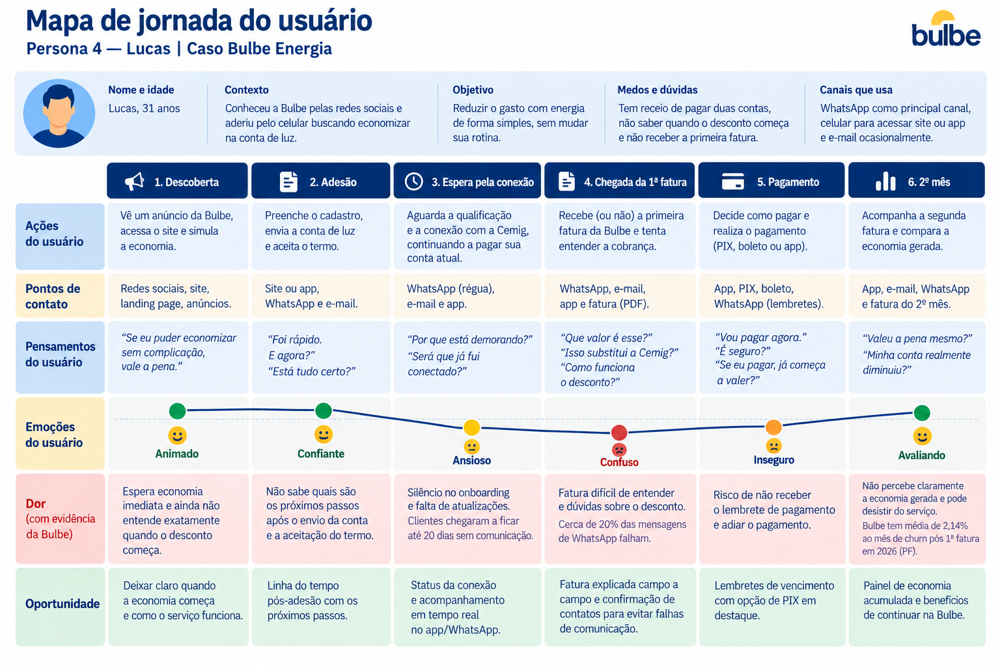

# Persona 4 — Lucas

Nome e idade: Lucas, 31 anos

Contexto: Conheceu a Bulbe pelas redes sociais e aderiu pelo celular buscando economizar na conta de luz.

Objetivo: Reduzir o gasto com energia de forma simples, sem mudar sua rotina.

Medos e dúvidas: Tem receio de pagar duas contas, não saber quando o desconto começa e não receber a primeira fatura.

Canais que usa: WhatsApp como principal canal, celular para acessar site ou app e e-mail ocasionalmente.

## Mapa de jornada

[Mapa de jornada em PNG](../wireframes/jornada-4.png)

| Fase | Ações | Pontos de contato | Pensamentos | Emoção | Dor (com evidência da Bulbe) | Oportunidade |
| --- | --- | --- | --- | --- | --- | --- |
| Descoberta | Vê um anúncio, acessa o site e simula a economia | Anúncio, site, landing page | “Se eu puder economizar sem complicação, vale a pena.” | Animado | Espera economia rápida e ainda não entende exatamente quando o desconto começa | Deixar claro quando a economia começa |
| Adesão | Envia a conta de luz e aceita o termo | Site ou app, WhatsApp | “Foi rápido. E agora?” | Confiante | Não sabe quais são os próximos passos | Linha do tempo pós-adesão |
| Espera pela conexão | Aguarda a qualificação e continua pagando a Cemig | WhatsApp, e-mail | “Já está funcionando? Por que ainda pago a Cemig?” | Ansioso | Pode haver silêncio no onboarding; clientes chegaram a ficar até 20 dias sem comunicação | Status da conexão e acompanhamento do processo |
| Chegada da 1ª fatura | Recebe a 1ª fatura e tenta entender a cobrança | WhatsApp, e-mail, app | “Que valor é esse? Isso substitui a Cemig?” | Confuso | Cerca de 20% das mensagens de WhatsApp falham e a fatura pode não chegar ou não ficar clara | Fatura explicada campo a campo e confirmação de contatos |
| Pagamento | Decide se paga e como pagar | PIX, boleto, app | “Melhor pagar logo para não esquecer.” | Inseguro | Sem lembrete, o pagamento pode ficar para depois; a Bulbe já observa alta adoção de PIX no pagamento | PIX em destaque e lembrete de vencimento |
| 2º mês | Compara as contas e decide se continua | App, fatura, atendimento | “Valeu a pena mesmo?” | Avaliando | Pode não perceber claramente a economia gerada e pode desistir do serviço | Painel de economia acumulada |