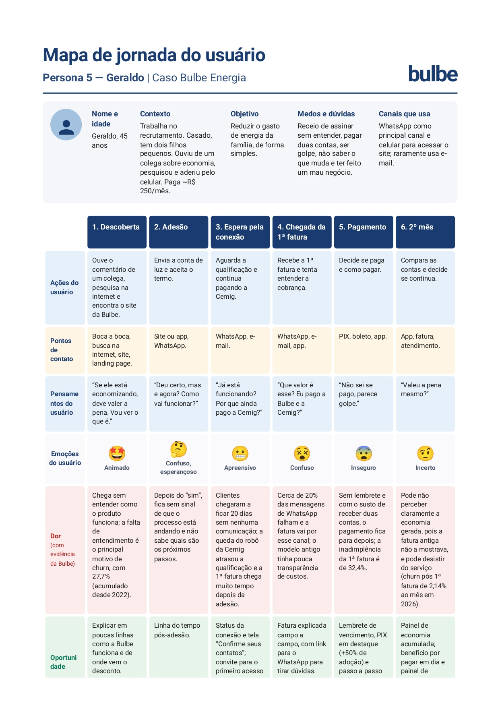

# Persona 5 — Geraldo

Nome e idade: Geraldo, 45 anos

Contexto: Trabalha no setor de recrutamento e seleção de uma empresa. É casado e tem dois filhos pequenos. Ouviu de um colega que ele estava economizando na conta de luz, e o colega explicou só superficialmente como funcionava. Em casa, curioso, pesquisou o site da Bulbe pelo celular e aderiu. Paga cerca de R$ 250 por mês de luz.

Objetivo: Reduzir o gasto de energia da família, de forma simples.

Medos e dúvidas: Tem receio de ter assinado algo sem entender, de pagar duas contas (Cemig e Bulbe), de ser golpe, de não saber o que muda na conta de luz e de ter feito um mau negócio por ter agido por impulso.

Canais que usa: WhatsApp como principal canal e celular para acessar o site; raramente usa e-mail.

## Mapa de jornada

[Mapa de jornada em PNG](../wireframes/jornada-5.jpg)

| Fase | Ações | Pontos de contato | Pensamentos | Emoção | Dor (com evidência da Bulbe) | Oportunidade |
| --- | --- | --- | --- | --- | --- | --- |
| Descoberta | Ouve o comentário de um colega, pesquisa na internet e encontra o site da Bulbe | Boca a boca, busca na internet, site, landing page | “Se ele está economizando, deve valer a pena. Vou ver o que é.” | Animado | Chega sem entender como o produto funciona; a falta de entendimento é o principal motivo de churn, com 27,7% (acumulado desde 2022) | Explicar em poucas linhas como a Bulbe funciona e de onde vem o desconto |
| Adesão | Envia a conta de luz e aceita o termo | Site ou app, WhatsApp | “Deu certo, mas e agora? Como vai funcionar?” | Confuso, porém esperançoso | Depois do “sim”, fica sem sinal de que o processo está andando e não sabe quais são os próximos passos | Linha do tempo pós-adesão |
| Espera pela conexão | Aguarda a qualificação e continua pagando a Cemig | WhatsApp, e-mail | “Já está funcionando? Por que ainda pago a Cemig?” | Apreensivo | Clientes chegaram a ficar 20 dias sem nenhuma comunicação; a queda do robô da Cemig atrasou a qualificação e a 1ª fatura chega muito tempo depois da adesão | Status da conexão e tela “Confirme seus contatos”; convite para o primeiro acesso ao aplicativo |
| Chegada da 1ª fatura | Recebe a 1ª fatura e tenta entender a cobrança | WhatsApp, e-mail, app | “Que valor é esse? Eu pago a Bulbe e a Cemig?” | Confuso | Cerca de 20% das mensagens de WhatsApp falham e a fatura vai por esse canal; o modelo antigo tinha pouca transparência de custos | Fatura explicada campo a campo, com link para o WhatsApp para tirar dúvidas |
| Pagamento | Decide se paga e como pagar | PIX, boleto, app | “Não sei se pago, parece golpe.” | Inseguro | Sem lembrete e com o susto de receber duas contas, o pagamento fica para depois; a inadimplência da 1ª fatura é de 32,4% | Lembrete de vencimento, PIX em destaque (+50% de adoção) e passo a passo para pagar com segurança |
| 2º mês | Compara as contas e decide se continua | App, fatura, atendimento | “Valeu a pena mesmo?” | Incerto | Pode não perceber claramente a economia gerada, pois a fatura antiga não a mostrava, e pode desistir do serviço (churn pós 1ª fatura de 2,14% ao mês em 2026) | Painel de economia acumulada; benefício por pagar em dia e painel de trajetória (sequência de faturas pagas) |